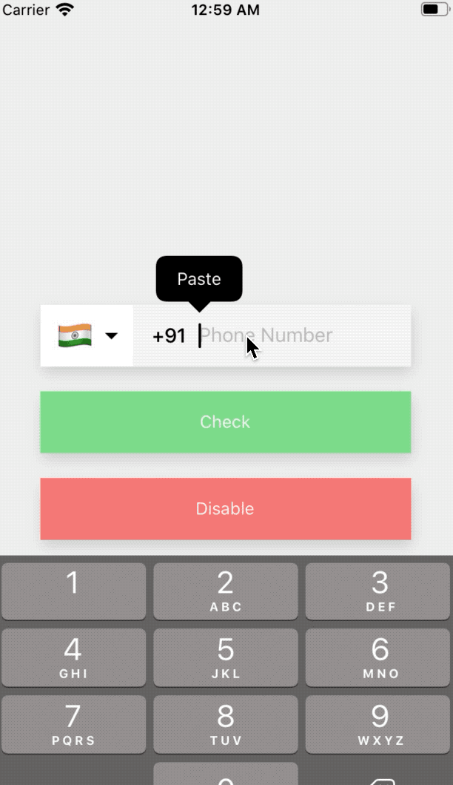
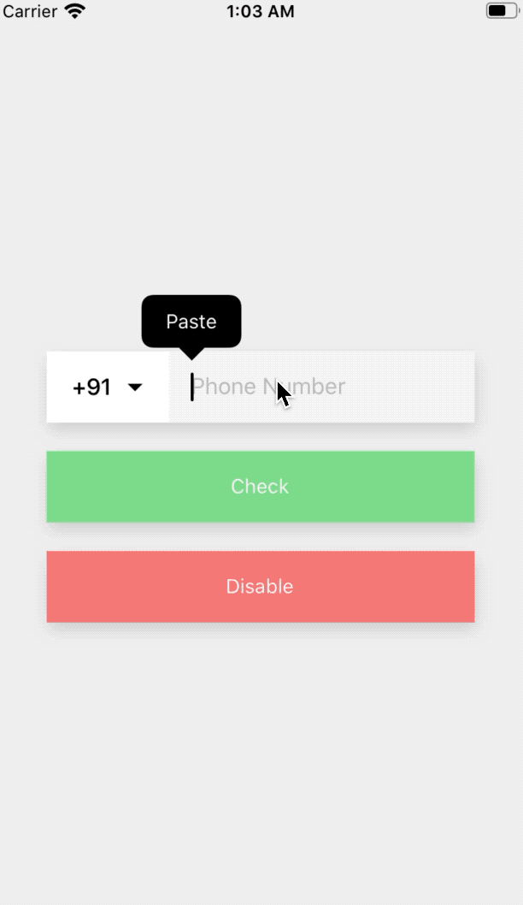

<div align="center">
  
  
</div>

<br>

<h1 align="center">React Native Phone Number Input
</h1>

<p align="center">Performance oriented React Native Phone Number Input with typings and proper validation for any country.
</p>

<h6 align="center">Made with ❤️ by developer for developers</h6>

<br>
<p align="center">


</p>

## Want to show your love?
<p>Click on 🌟 button.</p>


## Table of Contents

- [Table of Contents](#table-of-contents)
- [Installation](#installation)
- [Features](#features)
- [Usage](#usage)
- [Props](#props)
- [Methods](#methods)
- [FAQ](#faq)
  - [Is it supported and tested both on android and iOS?](#is-it-supported-and-tested-both-on-android-and-ios)
  - [NSURLResponse allHeaderFields: unrecognized selector sent to instance XX crash?](#nsurlresponse-allheaderfields-unrecognized-selector-sent-to-instance-xx-crash)
- [Contributing](#contributing)
  - [Step 1](#step-1)
  - [Step 2](#step-2)
  - [Step 3](#step-3)
- [Support](#support)
- [License](#license)
- [Hire](#hire)

## Installation

```bash
$ yarn add react-native-phone-number-input
```

OR

```bash
$ npm i react-native-phone-number-input --save
```

## Features

- :iphone: Works with iOS and Android, Cross-platform :100:
- :crossed_flags: Built-in country picker (uses [react-native-country-picker-modal][react-native-country-picker-modal])
- :wrench: Completely customizable UI!
- :heavy_check_mark: Proper validation (uses [google-libphonenumber](https://github.com/google/libphonenumber))

## Usage

For more complete example open [App.tsx](https://github.com/garganurag893/react-native-phone-number-input/blob/master/example/App.tsx)

```tsx
import React, { useState, useRef } from "react";
import {
  SafeAreaView,
  StyleSheet,
  View,
  StatusBar,
  TouchableOpacity,
  Text,
} from "react-native";
import PhoneInput from "react-native-phone-number-input";
import { Colors } from "react-native/Libraries/NewAppScreen";

const App: React.FC = () => {
  const [value, setValue] = useState("");
  const [formattedValue, setFormattedValue] = useState("");
  const [valid, setValid] = useState(false);
  const [showMessage, setShowMessage] = useState(false);
  const phoneInput = useRef<PhoneInput>(null);
  return (
    <>
      <StatusBar barStyle="dark-content" />
      <View style={styles.container}>
        <SafeAreaView style={styles.wrapper}>
          {showMessage && (
            <View style={styles.message}>
              <Text>Value : {value}</Text>
              <Text>Formatted Value : {formattedValue}</Text>
              <Text>Valid : {valid ? "true" : "false"}</Text>
            </View>
          )}
          <PhoneInput
            ref={phoneInput}
            defaultValue={value}
            defaultCode="DM"
            layout="first"
            onChangeText={(text) => {
              setValue(text);
            }}
            onChangeFormattedText={(text) => {
              setFormattedValue(text);
            }}
            withDarkTheme
            withShadow
            autoFocus
          />
          <TouchableOpacity
            style={styles.button}
            onPress={() => {
              const checkValid = phoneInput.current?.isValidNumber(value);
              setShowMessage(true);
              setValid(checkValid ? checkValid : false);
            }}
          >
            <Text>Check</Text>
          </TouchableOpacity>
        </SafeAreaView>
      </View>
    </>
  );
};

export default App;
```

## Props

- `defaultCode?`: [CountryCode](https://github.com/xcarpentier/react-native-country-picker-modal/blob/master/src/types.ts#L252)
- `withDarkTheme?`: boolean
- `withShadow?`: boolean
- `autoFocus?`: boolean
- `defaultValue?`: string
- `value?`: string
- `disabled?`: boolean
- `disableArrowIcon?`: boolean
- `placeholder?`: string;
- `onChangeCountry?`: (country: Country) => void;
- `onChangeText?`: (text: string) => void;
- `onChangeFormattedText?`: (text: string) => void;
- `containerStyle?`: `StyleProp<ViewStyle>`;
- `textContainerStyle?`: `StyleProp<ViewStyle>`;
- `renderDropdownImage?`: `JSX.Element`;
- `textInputProps?`: [TextInputProps](https://reactnative.dev/docs/textinput);
- `textInputStyle?`: `StyleProp<TextStyle>`;
- `codeTextStyle?`: `StyleProp<TextStyle>`;
- `flagButtonStyle?`: `StyleProp<ViewStyle>`;
- `countryPickerButtonStyle` : `StyleProp<ViewStyle>`;
- `layout?`: "first" | "second";
- `filterProps?`: CountryFilterProps;
- `countryPickerProps?`: any;

## Methods

- `getCountryCode`: () => [CountryCode](https://github.com/xcarpentier/react-native-country-picker-modal/blob/master/src/types.ts#L252)
- `getCallingCode`: () => string | undefined
- `getNumberAfterPossiblyEliminatingZero`: () => {number: string , formattedNumber: string };
- `isValidNumber`: (number: string) => boolean

## FAQ

### Is it supported and tested both on android and iOS?

YES

### NSURLResponse allHeaderFields: unrecognized selector sent to instance XX crash?

Upgrade `versions['Flipper'] ||= '~> 0.37.0'` in podfile.

## Contributing

> To get started...

### Step 1

- **Option 1**

  - 🍴 Fork this repo!

- **Option 2**
  - 👯 Clone this repo to your local machine using `https://github.com/garganurag893/react-native-phone-number-input`

### Step 2

- **HACK AWAY!** 🔨🔨🔨

### Step 3

- 🔃 Create a new pull request using <a href="https://github.com/garganurag893/react-native-phone-number-input" target="_blank">`https://github.com/garganurag893/react-native-phone-number-input`</a>.

## Support

Reach out to me at one of the following places!

- Twitter at <a href="https://twitter.com/AnuragG94634191" target="_blank">https://twitter.com/AnuragG94634191</a>
- Medium at <a href="https://medium.com/@garganurag893" target="_blank">https://medium.com/@garganurag893</a>
- Instagram at <a href="https://www.instagram.com/the_only_anurag/" target="_blank">https://www.instagram.com/the_only_anurag/</a>
- Email at garganurag893@gmail.com

## License

[](http://badges.mit-license.org)

- **[MIT license](http://opensource.org/licenses/mit-license.php)**

## Hire

Looking for a React/React-Native Freelance Expert? Email at garganurag893@gmail.com

[react-native-country-picker-modal]: https://github.com/xcarpentier/react-native-country-picker-modal
